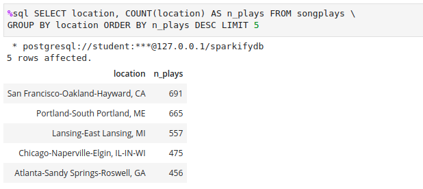

# Sparkify Project - Data Modeling with Postgres

## 1. Summary of the project

### 1.1 Problem
A startup called **Sparkify** wants to analyze the data they have been collecting about songs and user activity on their new music streaming app. The company is interested in finding out what songs users are listening to. The analysts don't have a were to query the data that is in a directory of JSON records about user activity in the app, as well as a directory with JSON metadata about the songs in their app.

### 1.2 Solution
I developed a solution using **Python** and **SQL** that collects and organizes client usage data and the application's song collection. I defined a star schema and the fact and dimension tables to receive the data. Finally, I wrote an ETL pipeline that transfers data from JSON files in two local directories to these tables in **Postgres** using Python and SQL.

#### 1.2.1 Schema

## 2. Python scripts

The solution has 3 Python files with the following functions:

- **`create_tables.py`**: This code **drops** and **creates** the tables. You need **run** this file to reset the tables **before each time you run your ETL** scripts.

- **`etl.py`**: **reads** and **processes** the files from song_data and log_data and loads them into the tables.

- **`sql_queries.py`**: contains **all project sql queries**. Its contain is imported into the other scheme Python files.

## 3. Project files

The project has, in addition to the Phyton files mentioned above, two notebooks and the JSON directories with the original data.

### 3.1 Notebooks:

- **`etl.ipynb`**: Reads and processes a single file from song_data and log_data and loads the data into the tables. This notebook **contains detailed instructions** on the ETL process for each of the tables.

- **`test.ipynb`**: displays the first few rows of each table to let you **check your database**.

- **`sample_queries.ipynb`**: contains sample queries for analysis.

### 3.2 Data directories

#### 3.2.1 Song Dataset: 
The first dataset is a subset of real data from the Million Song Dataset. Each file is in JSON format and contains metadata about a song and the artist of that song. The files are partitioned by the first three letters of each song's track ID.

*Song Dataset sample*

#### 3.2.2 Log Dataset
The second dataset consists of log files in JSON format generated by this event simulator based on the songs in the dataset above. These simulate activity logs from a music streaming app based on specified configurations.

*Log Dataset sample*

## 4. Running project

The correct order to run the project is the bellow:

1. Run **`create_tables.py`** to drop existing tables and create the final tables.
2. Run **`test.ipynd`** to verify if the tables was created correctly.
3. Run **`etl.py`** to read and process files from song_data and log_data and load the data into your tables.
4. Run **`test.ipynd`** again to verify if the data was loaded correctly.

## 5. Sample queries

Examples of requests made to the database for analysis.

#### Number of users by account type and gender.

#### Top 5 locations with the most played songs.

#### Top 5 locations with the most music played by paid users.

#### Top 5 users.

